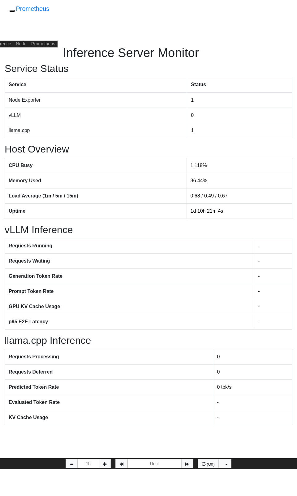

# Prometheus Inference Server Monitoring Demo

A self-contained demo showing how to use Prometheus to monitor a Linux host
running an AI inference server (vLLM or llama.cpp). Features a Prometheus
console template dashboard that shows service status, host metrics, and
inference metrics at a glance.

Uses Prometheus v2.55.1 (last 2.x release) which includes built-in console
template support with `prom.lib`, Bootstrap, and the Rickshaw graphing library.

## Prerequisites

- **Podman** (or Docker — replace `podman` with `docker` in the scripts)
- **node_exporter** — for host metrics (CPU, memory, load, uptime)
- **An inference server** (optional) — vLLM on port 8000 or llama.cpp on port 8080

## Quick Start

1. **Install node_exporter** (if not already running):

   ```bash
   ./setup-node-exporter.sh
   ```

2. **Build the container image:**

   ```bash
   ./build.sh
   ```

3. **Run Prometheus:**

   ```bash
   ./run.sh
   ```

4. **Open the dashboard:**

   http://localhost:9090/consoles/inference.html

## Load Testing

A simple load generator sends repeated inference requests so you can watch
dashboard metrics update in real time:

```bash
python3 load-gen.py
```

Options:

| Flag            | Default                    | Description                          |
|-----------------|----------------------------|--------------------------------------|
| `--url`         | `http://127.0.0.1:8080`   | Base URL (use `:8000` for vLLM)      |
| `--max-tokens`  | `50`                       | Max tokens per completion            |
| `--count`       | `0` (infinite)             | Number of requests, 0 = run forever  |
| `--delay`       | `0`                        | Seconds to wait between requests     |

The script uses only Python stdlib — no `pip install` needed. It retries on
connection errors, so you can start it before the server is ready.

## Port Reference

| Port | Service        |
|------|----------------|
| 9090 | Prometheus     |
| 9100 | node_exporter  |
| 8000 | vLLM           |
| 8080 | llama.cpp      |

## What You'll See



- **Service Status** — up/down indicators for node_exporter, vLLM, and llama.cpp
- **Host Overview** — CPU busy %, memory used %, load averages, uptime
- **vLLM Inference** — requests running/waiting, token throughput, GPU KV cache usage, p95 latency
- **llama.cpp Inference** — requests processing/deferred, token throughput, KV cache usage

Targets that aren't running will show as DOWN on the
[targets page](http://localhost:9090/targets) and their metrics will display
as `-` on the dashboard.
